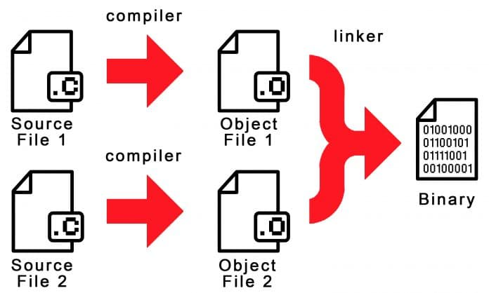

# Aula 01: Introdução e o Primeiro Makefile

> 🛑 **Pré-requisito Importante:**
> Para aproveitar esta aula ao máximo, é fundamental entender modularização em C — o que são *headers* (`.h`) e arquivos objeto (`.o`). Se ainda não domina esses conceitos, leia primeiro a [Aula Extra: Modularização em C](../aulas-extras/01-modularizacao-em-c.md) antes de prosseguir.

## 1. Introdução

O **Make** é uma ferramenta clássica de automação de *build* criada nos anos 70. Ele atua como um maestro: lê um arquivo de partitura chamado `Makefile` e executa os comandos necessários para compilar e montar o seu programa na ordem correta.

### O Problema que Resolvemos Aqui

<figure align="center">
  
  <figcaption><em>Figura 1: Fluxo de compilação em C. Fonte: https://embarcados.com.br/introducao-ao-makefile.</em></figcaption>
</figure>

Imagine um projeto com dezenas de arquivos `.c`. Compilar tudo manualmente — digitando `gcc arquivo1.c arquivo2.c arquivo3.c ... -o programa` — toda vez que você alterar uma linha de código traz três problemas:

1. **Lentidão:** Comandos enormes para digitar repetidamente.
2. **Propensão a erros:** Fácil esquecer de incluir um arquivo novo ou atualizado.
3. **Ineficiência:** O compilador retraduz *todos* os arquivos, mesmo os que você não tocou.

O Make resolve isso rastreando **dependências**. Ele analisa o projeto e deduz: *"Você só alterou `mensagem.c`. Vou recompilar apenas ele e juntar com o restante que já estava pronto."* Em projetos grandes, isso economiza horas de processamento.

---

## 2. Mão na Massa: Criando o Primeiro Makefile

> 💡 **Dica:** Os arquivos desta aula estão prontos em `exemplos/aula-01/`. Consulte-os se quiser comparar com o seu trabalho.

### Passo 1: Preparando o Código-Fonte

Crie uma pasta para o projeto e dentro dela crie os três arquivos abaixo:

**`mensagem.h`** — Declaração da função

```c
#ifndef MENSAGEM_H
#define MENSAGEM_H

void imprimir_saudacao();

#endif
```

**`mensagem.c`** — Implementação

```c
#include <stdio.h>
#include "mensagem.h"

void imprimir_saudacao() {
    printf("Olá! Seu Make está funcionando perfeitamente.\n");
}
```

**`main.c`** — Ponto de entrada

```c
#include "mensagem.h"

int main() {
    imprimir_saudacao();
    return 0;
}
```

Para compilar isso manualmente, o comando seria:

```
gcc main.c mensagem.c -o programa
```

Vamos automatizar exatamente esse processo.

---

### Passo 2: A Anatomia de uma Regra do Make

O Make funciona com base em **regras**. A sintaxe de toda regra é:

```makefile
alvo: dependencias
	comando
```

- **Alvo (Target):** O arquivo que queremos gerar, ou o nome de uma ação a executar.
- **Dependências (Prerequisites):** Os arquivos necessários para construir o alvo.
- **Comando (Recipe):** A instrução que o terminal executa para transformar as dependências no alvo.

---

### Passo 3: Escrevendo o Makefile

> ⚠️ **A Regra de Ouro do Make:** O espaço antes de cada `comando` **obrigatoriamente deve ser um `TAB`** — não espaços comuns. Se usar espaços, o Make falhará imediatamente com o erro `missing separator`. Configure seu editor para não converter tabs em espaços em arquivos `Makefile`.

Na mesma pasta dos arquivos `.c`, crie um arquivo chamado exatamente **`Makefile`** (sem extensão, com "M" maiúsculo) com o seguinte conteúdo:

```makefile
# Regra principal: gera o executável 'programa'
programa: main.o mensagem.o
	gcc main.o mensagem.o -o programa

# Compila main.c em main.o
main.o: main.c mensagem.h
	gcc -c main.c

# Compila mensagem.c em mensagem.o
mensagem.o: mensagem.c mensagem.h
	gcc -c mensagem.c

# Remove os arquivos gerados para forçar recompilação do zero
# Nota: tornaremos o 'clean' mais robusto na Aula 02 com o .PHONY
clean:
	rm -f *.o programa
```

> **Usuários Windows (prompt padrão):** substitua o comando do `clean` por `del /Q *.o programa.exe`. Se estiver usando o MSYS2 configurado na Aula 00, mantenha o `rm` — o terminal MSYS2 fornece as ferramentas GNU normalmente.

---

### Passo 4: Executando a Mágica

No terminal, dentro da pasta do projeto, execute:

```
$ make
gcc -c main.c
gcc -c mensagem.c
gcc main.o mensagem.o -o programa
```

O Make leu a primeira regra (`programa`), percebeu que precisava de `main.o` e `mensagem.o`, encontrou as regras para criá-los e executou os três comandos na ordem correta.

Execute o programa:

```
$ ./programa
Olá! Seu Make está funcionando perfeitamente.
```

**O Teste Definitivo da Eficiência:**

Execute `make` novamente, sem alterar nenhum arquivo:

```
$ make
make: 'programa' is up to date.
```

Nenhum comando foi executado. O Make comparou os timestamps dos arquivos, percebeu que nada mudou e não perdeu tempo recompilando o que já estava pronto. Esse é o comportamento central que torna o Make indispensável em projetos grandes.

**Alterando apenas um arquivo:**

Abra `mensagem.c`, faça qualquer alteração (como mudar o texto da mensagem) e execute `make`:

```
$ make
gcc -c mensagem.c
gcc main.o mensagem.o -o programa
```

Só `mensagem.c` foi recompilado. O `main.o` já estava atualizado e foi reaproveitado.

---

## 3. Resumo / Cheat Sheet

**Estrutura de uma regra:**

```makefile
alvo: dependencia1 dependencia2
[TAB]comando
```

| Conceito | Detalhe |
| --- | --- |
| **Tab obrigatório** | O Make exige `Tab` antes de cada comando. Espaços causam `missing separator`. |
| **Primeiro alvo** | Digitar `make` sozinho executa o **primeiro alvo** do arquivo. |
| **Flag `-c` do GCC** | `gcc -c arquivo.c` gera `arquivo.o` sem linkar. Essencial para compilação modular. |
| **`make clean`** | Apaga os arquivos compilados, forçando reconstrução completa do zero. |
| **Rastreamento de mudanças** | O Make compara timestamps: só recompila o que foi modificado desde a última build. |

---

## 4. O que veremos na próxima aula?

Se você observar o `Makefile` que escrevemos, vai notar que repetimos palavras várias vezes — o nome `gcc`, os arquivos `.o`, e assim por diante. Em projetos que crescem rápido, essa repetição vira um problema de manutenção.

Na **Aula 02**, vamos resolver isso com **Variáveis e Macros** no Make, deixando o script de build muito mais limpo e com cara de código profissional.